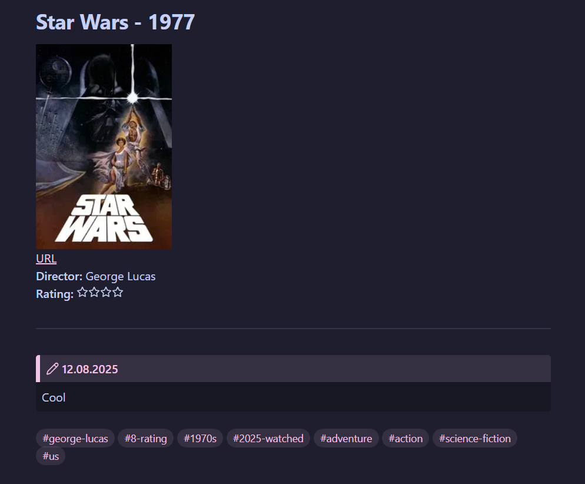

# ExportLbLogs
This is a Python tool that retrieves your latest Letterboxd diary entries via RSS, adds movie data from TMDB using their API, and generates a Markdown note for journaling. It also optionally transfers the movie rating from Letterboxd log to Kinopoisk using Selenium.


## Features
- Fetches the **5 most recent diary entries** from your Letterboxd RSS feed.
- Retrieves metadata (e.g., poster, director, genres) from **TMDB API** (requires TMDB access token).
- Generates a **Markdown note** (or updates existing one), including:
  - Movie details (poster, letterboxd URL, director etc.)
  - Your rating, watch date, and space to add personal thoughts
  - Tags based on rating, release year, genres, etc.
- Optional: Uses **Selenium** to automatically rate the movie on **Kinopoisk**. Requires you to have **ChromeDriver** and to pre-log into Kinopoisk in your browser profile.


## Installation
1. **Clone the Repository**:
  ```shell
  git clone https://github.com/blackmidinewroad/ExportLbLogs.git
  cd ExportLbLogs
  ```

2. **Install Dependencies**
  - Using pipenv:

      ```shell
      pipenv install
      ```
   - Using pip:
   
      ```shell
      pip install -r requirements.txt
      ```

3. **Set Up Environment Variables**

  Create a `.env` file in the project root with the following:
  ```env
  LB_USERNAME='your-letterboxd-username'
  OBSIDIAN_VAULT_PATH='path/to/notes/folder'
  NOT_RATED_FILE='path/to/not/rated/log.md'
  CHROME_DRIVER_FILE='path/to/chromedriver.exe'
  CHROME_USER_DATA_DIR='path/to/user-data/folder'
  TMDB_ACCESS_TOKEN='your-tmdb-access-token'
  ```

  - Replace `path/to/notes/folder` with the actual path to the folder where notes will be stored (e.g., `D:/ObsidianVaults/MyVault/Movies`).
  - Replace `path/to/not/rated/log.md` with the actual path to the file where not rated movies will be stored (e.g., `D:/ObsidianVaults/MyVault/Movies/NotRated/log.md`).
  - Replace `path/to/chromedriver.exe` with the actual path to the ChromeDriver file (e.g., `C:/ChromeDriver/chromedriver.exe`).
  - Replace `path/to/user-data/folder` with the actual path to the Chrome User Data folder (e.g., `C:/Users/JohnDoe/AppData/Local/Google/Chrome/User Data`).
  - Replace `your-tmdb-access-token` with your actual access token. If you don't have it yet, sign up at [TMDB](https://www.themoviedb.org/), then go to [API settings](https://www.themoviedb.org/settings/api) to register for an API access. After API registration you will have `API Read Access Token` in your profile settings.


## Usage
- **Run Directly**:
  ```shell
  cd project/root/folder
  python notescreator/log_to_note.py
  ```

- **Automation**

  To set up automatic execution (e.g., via Windows Task Scheduler), you can build a standalone executable using PyInstaller:

  ```shell
  cd project/root/folder
  pyinstaller --onefile --noconsole --paths "project/root/folder" notescreator/log_to_note.py
  ```

  Once built, use Task Scheduler to run `.exe` automatically. You may need to set the `Start in` field to `project/root/folder` in the Task Scheduler action for it to work properly.


## Example of Generated Markdown Note
```markdown

[URL](https://letterboxd.com/tmdb/11)
**Director:** George Lucas
**Rating:** :luc_star::luc_star::luc_star::luc_star:

---

> [!NOTE] 12.08.2025


#george-lucas #8-rating #1970s #2025-watched #adventure #action #science-fiction #us 
```

## Example in Obsidian

